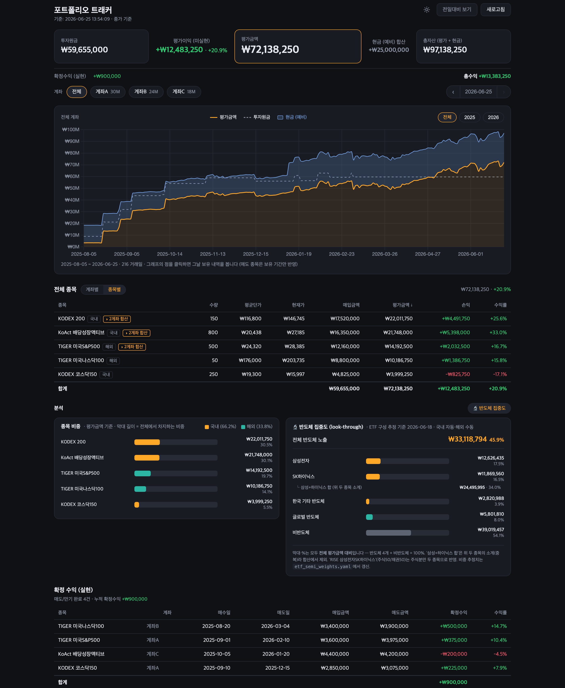

# Stock Portfolio Tracker

A local web dashboard that turns your trade ledger (buys and sells) into current holdings
valuation, realized P/L, and a daily market-value curve from your first purchase to today.

> Built for Korean-listed (KRX) ETFs — including ones that hold overseas assets. Daily closes come
> from [pykrx](https://github.com/sharebook-kr/pykrx) (KRX) and [yfinance](https://github.com/ranaroussi/yfinance).
> **The dashboard UI is in Korean.** This README maps the key terms to English (see
> [What's on screen](#whats-on-screen)); for the rest, your browser's auto-translate works fine.

## Preview

**By account (default)** — asset-flow summary, value curve, per-account holdings, realized P/L:


**By stock, with `--semi`** — weight bars (종목 비중) and the semiconductor look-through panel
(반도체 집중도) below the holdings table:



> Screenshots use the bundled **sample data** (`transactions.example.yaml`), not real holdings.
> Run it yourself and the same screens render from your own ledger (`transactions.yaml`).

## Install · Run

### Let Claude Code do it (the easy way)

Open [Claude Code](https://claude.com/claude-code) in a terminal and **paste this:**

> Clone and run https://github.com/beingcognitive/stock_portfolio for me.
> Create a venv, install `requirements.txt`, then start the dashboard **in the background** with the
> sample data and **open the URL in my browser** (use another port if it's taken). Then show me how
> to put my own trades into `transactions.yaml`.

It handles the clone, venv, dependencies, and run, then walks you through filling in your ledger.
(For the format, see the field notes at the top of the file and the
[Editing the ledger](#editing-the-ledger-single-source) section below.)

### Manual install

```bash
git clone https://github.com/beingcognitive/stock_portfolio.git
cd stock_portfolio
python3 -m venv .venv
.venv/bin/pip install -r requirements.txt

# Add your trades: copy the sample and fill it in (transactions.yaml is gitignored)
cp transactions.example.yaml transactions.yaml
#   If transactions.yaml is absent, it just runs on the sample data.

# Start the dashboard (Windows: .venv\Scripts\python app.py)
.venv/bin/python app.py
# → open http://127.0.0.1:8000 in your browser (port clash: app.py --port 8001)
# Calm mode is the default (no day-over-day numbers). Add --show-daily to see them:
#   .venv/bin/python app.py --show-daily
# Opt-in: show the semiconductor look-through panel (needs etf_semi_weights.yaml):
#   .venv/bin/python app.py --semi
```

> On Windows, replace `.venv/bin/` with `.venv\Scripts\` in the commands above.

### Filling in your trades (no hand-writing YAML)

You don't have to format `transactions.yaml` by hand. Give your brokerage transaction history
as-is (text, CSV, or a screenshot of the table) to Claude Code and **say:**

> Here's my brokerage transaction history (↓ replace the line below with the text, or drag a screenshot in):
> [transactions here]
> Turn this into `transactions.yaml` (`lots` / `closed` / `cash`). Follow the format in
> `transactions.example.yaml` and the "Editing the ledger" section of the README. Rules:
> - For each ETF set `ticker`, the 6-digit `krx_code`, and `region` (`국내` for domestic-asset ETFs,
>   `해외` for foreign-asset ones). **If you're unsure, ask me — don't guess** (a wrong code breaks price lookups).
> - For sells, I also need the actual sale proceeds (`proceeds`) and the **buy tranches (when and how
>   much I bought in each lot)** — ask if they're missing.
> - When done, show me a name↔code table so I can verify.

Claude Code sorts your holdings, closed trades, and cash, and asks instead of guessing on unknown
values, which avoids silent errors. After that, just hand it any new trades.

Don't know an ETF's KRX code? Give Claude the fund's English name or ISIN and ask it to find the
6-digit KRX listing code — then check it against the name↔code table it shows you.

🔒 Everything runs on your own machine and `transactions.yaml` is gitignored (never pushed). But text
you paste into Claude Code is transmitted, so strip out account numbers and personal ID numbers
(SSN, resident registration number, etc.) and share only the trades.

## What's on screen

On-screen labels are Korean; below, the English term comes first with the Korean label in parentheses.

- **Asset flow (summary)** : reads left to right as Cost basis (투자원금) → (unrealized P/L) →
  **Market value (평가금액)** → (+ cash) → Net worth (총자산). **Market value** is the focus
  (yellow border); cash is just added on to reach net worth. The cash step (+ cash → 총자산) is tied
  to the cash-reserve toggle (see below), so when cash is off the flow ends on **Market value**. A line
  below shows realized P/L (확정수익) and total gain (unrealized + realized) separately.
- **Account filter (pills)** : only accounts that hold something appear as pills. Click to filter to
  that account; **전체** (All) clears it. (Cash-only accounts have nothing to show, so they're left off.)
  A **date stepper** (‹ date ›) at the right of this row moves through trading days one at a time.
- **Value curve** : daily market value (평가금액) vs. cost basis (투자원금) from your first purchase
  onward, with an optional **cash-reserve band** (현금 예비) drawn on top of market value — its upper edge
  is net worth (총자산). A sold position counts **only while you held it**; after the sale it moves to
  realized P/L. If you sold everything before a given day, the curve drops to (near) zero that day — the
  real cash-out, shown as-is.
- **Holdings table** : per ticker — shares / average cost / current (or as-of-date close) price / cost /
  market value / P/L / return %. A **계좌별 / 종목별** (by-account / by-stock) toggle next to the first
  heading switches between one table per account and a single table that merges each ticker across accounts.
- **Weight bars (종목 비중)** : in the **종목별** (by-stock) view, a horizontal bar chart under the table
  shows each holding's share of total market value (bar length = % of total, biggest first), with the
  amount and % on the right and a 국내 / 해외 (domestic / overseas) split in the legend. Colors are
  categorical — 국내 orange, 해외 teal — kept distinct from the green/red used for P/L.
- **Semiconductor concentration (반도체 집중도, look-through — opt-in)** : with `--semi`, a toggle on an
  **분석** (analysis) bar reveals a second card that "sees through" your ETFs to their actual chip exposure
  — Samsung Electronics (삼성전자), SK hynix (SK하이닉스), other Korean semis, global semis, and the
  non-semi remainder — each as an amount + % of total. See [Semiconductor look-through](#semiconductor-concentration-look-through---semi).
- **Realized P/L table** : completed sells/expirations and cumulative realized gain.

**On-screen labels (Korean → English):** 종목 = name · 수량 = shares · 평균단가 = avg cost ·
현재가 = current price · 투자원금 = cost basis · 매입금액 = cost · 평가금액 = market value ·
현금 (예비) = reserve cash · 총자산 = net worth · 손익 = P/L · 수익률 = return % · 합계 = total ·
계좌별 / 종목별 = by account / by stock · N계좌 합산 = merged across N accounts · 전일대비 = vs. prior day ·
확정 수익 (실현) = realized P/L · 매수일 / 매도일 = buy / sell date · 매도금액 = proceeds ·
새로고침 = Refresh · 전체 = All · 현재로 돌아가기 = Back to today.
(Or just let your browser auto-translate the page.)

## Interactions

- **Click a point on the graph** : the summary, holdings table, and realized P/L all switch to that
  date. (Positions held that day — including ones later sold — are valued at that day's close.) The
  selected day shows a **white-bordered dot + faint dotted vertical line**; hovering shows a small ring.
  Use **현재로 돌아가기** (Back to today) in the top banner to return.
- **Click an account pill** : filter to that account only. **Cmd/Ctrl+click** toggles a pill in or out
  of the selection, so you can combine several (e.g. account A + B). Chart, tables, and realized P/L
  follow the selection. **전체** (All), or nothing selected, means everything.
- **Date stepper (‹ date ›, right of the filter row)** : step one trading day at a time; the **← / →**
  keys do the same. It stays within the visible range (so with a year filter on, it stops at that year's
  edges), and the date in the middle doubles as "jump back to the latest day."
- **Year selector (top-right of chart)** : All / per-year buttons zoom the curve to that year. Buttons
  are generated from the years present in your data. The Y-axis always starts at 0.
- **Cash-reserve toggle (현금 예비 in the chart legend)** : click the legend chip to overlay your reserve
  cash as a band on top of market value, so the curve's top edge reads as net worth (총자산). One toggle
  drives both views — the chart band **and** the summary's **+ cash → 총자산 step** flip together. It
  follows a simple rule, and you can always override it by clicking the chip:
  - **On by default** — the whole-portfolio landing view, where net worth (stocks + cash) is the point.
  - **Entering a single-account filter from 전체 turns it off** — once you zoom into one account, the
    focus is that account's stocks, so cash drops away. While you stay in filter mode (adding/removing
    accounts) it keeps whatever you last set.
  - **전체 (All) turns it back on** — clearing the filter returns to the whole-portfolio view.

  The reserve is **universal** — it shows on top of *any* account selection (see notes).
- **Holdings view toggle (계좌별 / 종목별)** : switch the holdings between per-account tables and one
  by-stock table. In **종목별**, a ticker held in several accounts gets an **N계좌 합산** tag and **expands
  on click** into an indented per-account breakdown.
- **Semiconductor toggle (반도체 집중도, only with `--semi`)** : a toggle on the **분석** bar (between the
  by-stock table and the charts) shows/hides the look-through card; the by-stock view then lays the
  weight-bar card and the semiconductor card **side by side** (stacking on narrow screens). The choice is
  saved in the browser.
- **Theme toggle (icon button, top-right header)** : flip light / dark; the choice is saved in the browser.

All computation runs in the browser from a single `/api/data` fetch, so clicks/filters are instant.

## Data refresh / caching

- **Ledger (lots/closed)** : `transactions.yaml` is re-read on every request, so after editing it just
  **refresh the browser** — no server restart needed.
- **Prices** : past closes don't change, so they're cached and reused; refetched only when:
  - the server first starts (full history),
  - 30 minutes have passed since the last price refresh, or
  - you hit the **Refresh button** (ignores the server cache and forces an update).
- The **Refresh button** calls `/api/data?force=1` and refetches **only the last 7 days for
  currently-held tickers** (already-sold tickers have only past, fixed prices). It shows
  **갱신 중…** (refreshing…) while it works.
- **During market hours (09:00–15:30 KST)** : this is a "closing-price" dashboard, most accurate after
  the close. Intraday, the last point is provisional (yfinance lags ~15 min; pykrx gives no intraday
  close before the close) and settles after close. Past dates are always final.

## Editing the ledger (single source)

All data comes from one file, `transactions.yaml` (or `transactions.example.yaml` if it's absent).
This file is personal, so it's excluded from the repo via `.gitignore`.

- `lots` : open buy positions. Add/remove lines as you buy and sell. Current holdings per account are
  auto-aggregated by (account, ticker).
- `closed` : completed sells (or expiries). Grouped per ticker, but each buy **tranche** is kept by
  date. That way the cost-basis curve accrues at each tranche's actual buy date (not pulled forward),
  and the held-period valuation uses the tranche's shares. Realized P/L = `proceeds` (the actual sale
  amount) − sum of tranche costs.
- `cash` (optional) : reserve cash outside your investments. Kept out of cost basis / market value /
  return %, and only added into **net worth (market value + cash)** and the asset flow. Recorded by
  date, so moving cash into a position reconciles automatically: one negative `amount` line + one buy
  `lot`. Treated like an account, but with no holdings it won't appear as a filter pill.

A few per-row fields, in English:
- `ticker` is the Yahoo Finance symbol (6-digit code + `.KS`); `krx_code` is the bare KRX short code
  for pykrx (usually 6 digits, occasionally alphanumeric like `0185L0`). The digits repeat on purpose — both are needed.
- `region` (`국내` = domestic-asset, `해외` = overseas-asset) is a **display-only tag**: copy the exact
  Korean value from the example — it does *not* affect prices or any calculation.
- Account names (`계좌A`…) and cash labels (`케이뱅크`, `예비현금`) are just placeholders — rename them to
  anything, in any language (they show verbatim as filter pills).

The file's own header comments describe each field (in Korean); the English summary above covers the same ground.

## Semiconductor concentration (look-through, `--semi`)

ETF names hide what you actually own. With `app.py --semi`, the by-stock view adds a **반도체 집중도
(look-through)** card that multiplies each held ETF's saved semiconductor weights by its live market
value to estimate your real exposure to Samsung Electronics, SK hynix, other Korean semis, and global
semis — plus the non-semi remainder (the buckets sum to 100% of market value). It's off by default
because it's a personalized analysis that depends on an external, hand-maintained weights file.

- **Weights file** : `etf_semi_weights.yaml` (keyed by `krx_code`, with an `as_of` date). Edit it by
  hand for overseas/mixed ETFs; the card simply doesn't render if the file is missing.
- **Auto-refresh (domestic)** : `python refresh_semi_weights.py` pulls each held **domestic** ETF's
  current top-10 constituents from Naver and rewrites the Samsung / SK hynix / other-Korean-semi
  weights into `etf_semi_weights.auto.yaml` (gitignored). Overseas and mixed ETFs are skipped (their
  weights aren't published there) and stay under your manual file. `portfolio.py` merges the two — the
  auto file overrides domestic buckets, the manual file keeps the rest.
- **Staleness** : the card shows the `as_of` date and warns when it's older than ~45 days. Active ETFs
  drift, so re-run the refresh (or edit the file) periodically — exact decimals aren't the point, only
  not misreading the big picture.

> Limitation: the auto-refresh sees only the top 10 holdings, so semis outside an ETF's top 10 can be
> undercounted in "other Korean semis" (Samsung/SK hynix are always near the top, so those are accurate).

## Price sources

- Current/past closes: 6-digit numeric KRX codes are looked up via `pykrx` first; alphanumeric codes
  (e.g. `0185L0`) or failures fall back to `yfinance` (`.KS`).
- Every position (held or closed) has a ticker, so it's valued at actual closes. If a given day's close
  is unavailable, it's forward-filled from the prior trading day's close; failing that, the tranche's
  buy price is used. Rows priced from a forward-filled close show a **⚠ stale** marker (and a banner),
  so a not-yet-updated value never silently passes as final — this shows even in calm mode.

## Value curve to the console

```bash
.venv/bin/python app.py --curve
```

## Files

| File | Role |
|------|------|
| `transactions.yaml` | the trade ledger (what you edit): `lots` + `closed` + `cash` |
| `prices.py` | price lookup — current price + historical close series (pykrx + yfinance) |
| `portfolio.py` | holdings, realized-P/L aggregation, daily value curve, the `/api/data` dataset |
| `app.py` | Flask web server (`/` dashboard, `/api/data`); flags `--show-daily`, `--semi` |
| `templates/index.html` | the dashboard (all rendering/recompute happens in the browser) |
| `etf_semi_weights.yaml` | semiconductor look-through weights per ETF (for `--semi`); manual base, merged with the auto file |
| `refresh_semi_weights.py` | refreshes domestic ETF semiconductor weights from Naver → `etf_semi_weights.auto.yaml` |

## Implementation notes (key decisions & assumptions)

- **Single source of truth = the ledger** : not a static holdings snapshot but a buy/sell ledger, from
  which current holdings, realized P/L, and the daily curve are all derived. Closed trades are grouped
  per ticker but keep their buy **tranches** by date/shares/amount.
- **What "cost basis" (투자원금) means** : the summed buy cost of positions held *on that day*. It rises
  at each tranche's buy date and falls when you sell (the gain moves to realized P/L). So it's the cost
  of *current* holdings, not cumulative deposits — which is why it drops on a sell day.
- **Tranche split avoids pull-forward** : lumping a closed position into one block (full amount at the
  first buy date) pulls cost basis earlier than reality and distorts the start of the curve. Splitting
  by tranche accrues it at the real buy dates.
- **Curve start** : drawn from the oldest buy date in your history.
- **Realized-P/L accuracy** : when the sale amount (`proceeds`) is known, it's used directly, so
  realized P/L = proceeds − sum of tranche costs is exact.
- **When you have to estimate** :
  - If you don't know the share count, round (cost ÷ fill price) to an integer (error usually < 0.1%).
  - For a closed trade with an unknown sale amount, estimate `proceeds` from the sell-date close (or the
    open, if sold near the open). Replace it once you have the exact figure.
  - Dividends are best left out of realized P/L to keep it simple (track separately if you want).
- **Cash is a separate, universal bucket** : reserve cash isn't mixed into cost basis / market value /
  return %, only into **net worth (market value + cash)** and, when the cash toggle is on, the asset
  flow's net-worth step and the chart's cash band. It lives in cash-only accounts that never hold stock, so it can't be picked as a
  filter pill; the dashboard therefore treats it as **universal** — the full reserve shows on top of *any*
  account selection, not just **전체**. This keeps two stories — investment performance (return, P/L) and
  balance (net worth) — apart, so the same number never shows twice.
- **By-stock view (종목별)** : aggregates each ticker across all accounts (summed shares / cost / value,
  with average price and return recomputed); a ticker spanning multiple accounts carries an **N계좌 합산**
  tag and expands to its per-account rows. The per-account view (**계좌별**) is the default. Both honor the
  account filter and the selected date.
- **Day-over-day (daily change) definition** : the "전일대비" line under the unrealized-P/L node and each
  account total is the **pure price move of positions held on *both* yesterday and today**, valued at the
  continuously-held share count (`min(yesterday, today)`), from the prior trading day's close to today's.
  Today's buys (not held yesterday) and sells (not held today) are excluded symmetrically, so cash flows
  don't leak in. It's a **separate metric** from cumulative P/L (vs. cost) and from realized P/L, and on
  a no-trade day it equals the price move of your holdings. The denominator is yesterday's held value,
  making it a daily %. A ticker bought today isn't in the total, so its row's day-over-day arrow (▲▼) is
  hidden too (for consistency).
- **Calm mode (default)** : all day-over-day signals — the 전일대비 line under unrealized P/L, the same line
  under each account total, and the per-row ▲▼ price arrows — are **hidden by default**. Checking a
  portfolio more often surfaces noise-level losses more often, which feeds short-term anxiety (myopic loss
  aversion), so the default view keeps only cumulative figures and the curve. A **전일대비 보기 / 숨기기**
  toggle in the header flips it live (no restart); the choice is saved in the browser (`localStorage`) and
  overrides the default on later visits. `app.py --show-daily` only sets the *initial* default before you've
  toggled.
- **No browser cache** : a `Cache-Control: no-store` header is set so stale JS doesn't read new data and
  break after a code update.
