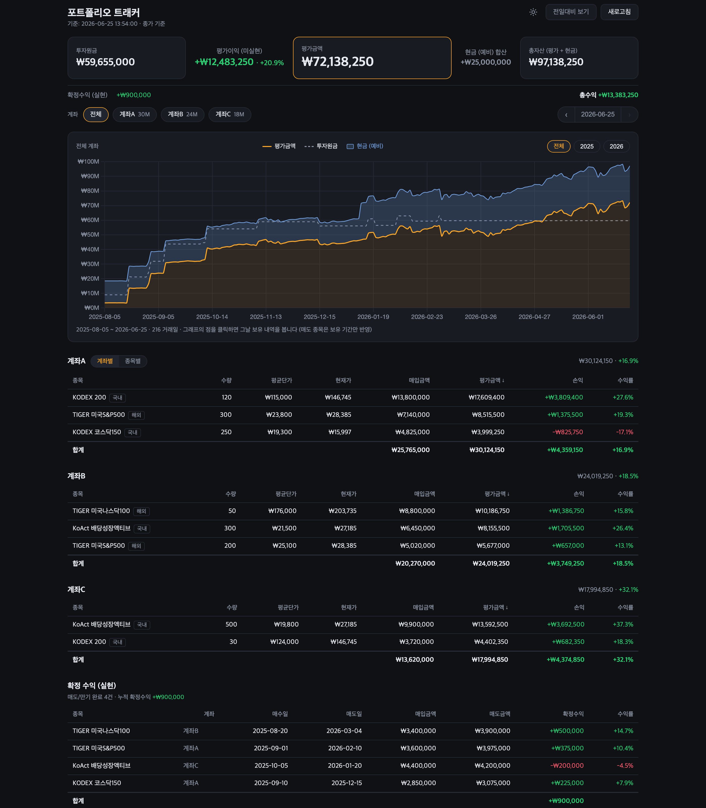

# 주식 포트폴리오 트래커

거래 원장(매수·매도 내역)을 기반으로 현재 보유 평가, 확정수익(실현 손익),
그리고 올해 초부터 오늘까지의 일별 가치 곡선을 보여주는 로컬 웹 대시보드.

> 종목 일별 종가는 [pykrx](https://github.com/sharebook-kr/pykrx) (KRX) 와
> [yfinance](https://github.com/ranaroussi/yfinance) 로 가져옵니다. 한국 ETF에 맞춰져 있습니다.

## 미리보기



> 위 화면은 저장소에 포함된 **예시 데이터**(`transactions.example.yaml`)로 생성된 것이며, 실제 보유가 아닙니다.
> 직접 실행하면 본인 거래 원장(`transactions.yaml`) 기준으로 동일한 화면이 나타납니다.

## 설치 · 실행

### Claude Code에게 맡기기 (요즘 방식)

터미널에서 [Claude Code](https://claude.com/claude-code) 를 켜고 **이걸 붙여넣으세요:**

> https://github.com/beingcognitive/stock_portfolio 를 클론해서 실행해줘.
> 가상환경(venv) 만들고 `requirements.txt` 설치한 뒤, 우선 예시 데이터(`transactions.example.yaml`)로
> 대시보드를 띄워줘. 그다음 내 실제 거래를 `transactions.yaml` 에 어떻게 넣는지 알려줘.

클론·가상환경·의존성·실행까지 알아서 처리하고, 본인 거래 원장을 채우는 방법까지 안내합니다.
(원장 형식은 파일 맨 위 필드 설명과 아래 [거래 내역 수정](#거래-내역-수정-단일-소스) 섹션 참고.)

### 직접 설치하려면

```bash
git clone https://github.com/beingcognitive/stock_portfolio.git
cd stock_portfolio
python3 -m venv .venv
.venv/bin/pip install -r requirements.txt

# 본인 거래 입력: 예시 파일을 복사해 채우기 (transactions.yaml 은 git 추적 제외됨)
cp transactions.example.yaml transactions.yaml
#   transactions.yaml 이 없으면 예시 데이터로 그대로 실행됩니다.

# 대시보드 띄우기
.venv/bin/python app.py
# → 브라우저에서 http://127.0.0.1:5000 열기
```

### 거래 내역 채우기 (YAML 손으로 안 짜도 됨)

`transactions.yaml` 을 직접 정리할 필요 없습니다. 증권사 거래내역을 그대로
(텍스트·CSV·표 캡처) Claude Code에 주고 **이렇게 말하세요:**

> 내 증권사 거래내역이야. [여기 붙여넣기 / 캡처 첨부]
> 이걸 `transactions.yaml` 형식(`lots` / `closed` / `cash`)으로 정리해줘 —
> 형식은 `transactions.example.yaml` 과 아래 "거래 내역 수정" 섹션을 참고해.

Claude Code가 보유·청산·현금을 분류하고 매수 회차(tranches)까지 맞춰 채워줍니다.
이후 매매가 생기면 그 내역만 다시 주면 됩니다.

## 화면 구성

- **자산 흐름(요약)** : 투자원금 → (평가이익/손실, 미실현) → **평가금액** → (+현금) → 총자산 으로
  이어 읽는 가로 흐름입니다. 핵심은 **평가금액**(노란 테두리로 강조)이고, 현금은 부가 정보로
  총자산에 합산만 합니다. 아래 줄에 확정수익(실현)과 총수익(미실현+실현)을 따로 표시합니다.
- **계좌 필터 (알약)** : 보유 종목이 있는 계좌만 알약으로 노출. 클릭하면 그 계좌로 필터,
  '전체'로 해제합니다. (현금 전용 계좌는 보여줄 내역이 없어 필터에서 제외)
- **가치 곡선** : 최초 매수(2025-08)부터 일별 평가금액 vs 투자원금.
  매도한 종목은 **보유했던 기간 동안만** 곡선에 반영되고, 매도 후에는 확정수익으로 집계됩니다.
  특정일 전 종목을 매도하면 그날 곡선이 푹 꺼지는데, 이는 실제 현금화를 그대로 보여주는 것입니다.
- **계좌별 보유 테이블** : 종목별 수량/평균단가/현재가(또는 기준일 종가)/손익/수익률.
- **확정 수익 테이블** : 매도·만기 완료된 거래와 누적 확정수익.

## 인터랙션

- **그래프 점 클릭** : 그 날짜 기준으로 요약·보유 테이블·확정수익이 모두 바뀝니다.
  (그날 보유 중이던 종목 — 이후 매도한 종목 포함 — 을 그날 종가로 평가)
  선택한 날은 **흰 테두리 점 + 옅은 점선 세로선**으로 표시되고, 마우스를 올리면 그 지점에
  작은 링이 나타납니다. 상단 배너의 **"현재로 돌아가기"** 로 오늘 시점으로 복귀.
- **계좌 알약(pill) 클릭** : 해당 계좌로 필터. 여러 개를 클릭하면 합산
  (예: 계좌A + 계좌B). 차트·테이블·확정수익이 선택에 맞춰 갱신됩니다.
  '전체'를 누르거나 아무것도 선택하지 않으면 전체.
- **연도 선택 (차트 우상단)** : 전체 / 연도 버튼으로 곡선을 해당 연도로 확대해 봅니다.
  버튼은 데이터에 있는 연도에서 자동 생성됩니다. Y축은 항상 0부터.

모든 계산은 `/api/data` 한 번 받아 브라우저에서 즉시 처리하므로 클릭/필터에 지연이 없습니다.

## 데이터 갱신 / 캐시 동작

- **원장(lots/closed)** : 매 요청마다 `transactions.yaml` 을 새로 읽습니다.
  따라서 종목을 편집한 뒤 **브라우저만 새로고침해도** 바로 반영됩니다(서버 재시작 불필요).
- **가격** : 과거 종가는 변하지 않으므로 캐시해 재사용하고, 다음 경우에만 다시 받습니다.
  - 서버 첫 기동 (전 구간 수집)
  - 마지막 가격 갱신 후 30분 경과
  - **새로고침 버튼** (서버 캐시를 무시하고 강제 갱신)
- **새로고침 버튼** 은 `/api/data?force=1` 로 최신가를 다시 받습니다. 이때 전체가 아니라
  **현재 보유 중인 티커의 최근 7일치만** 다시 받습니다(이미 매도한 종목은 가격 이력이
  전부 과거라 갱신 불필요). 갱신 동안 버튼이 "갱신 중…" 으로 비활성화됩니다.
- **장중(09:00–15:30 KST)** : "종가 기준" 대시보드라 장 마감 후 가장 정확합니다.
  장중에는 당일 마지막 점이 잠정값(yfinance는 약 15분 지연, pykrx는 마감 전 당일 종가
  미제공)이며 마감 후 확정됩니다. 과거 날짜는 항상 확정값입니다.

## 거래 내역 수정 (단일 소스)

모든 데이터는 `transactions.yaml` 한 파일에서 옵니다 (없으면 `transactions.example.yaml`).
이 파일은 개인 정보라 `.gitignore` 로 저장소에서 제외됩니다.

- `lots` : 현재 보유 중인 매수 건. 사고팔 때 여기에 줄을 추가/삭제하세요.
  계좌별 현재 보유는 (계좌, 티커) 기준으로 자동 합산됩니다.
- `closed` : 매도(또는 만기 청산) 완료 거래. 종목 단위로 묶되 실제 매수
  **회차(tranches)** 를 날짜별로 보관합니다. 덕분에 투자원금 곡선이 회차별
  매수일에 정확히 누적되고(앞당겨 잡히지 않음), 보유 기간 평가도 회차 수량으로
  계산됩니다. 확정수익 = `proceeds`(시트의 실제 매도금액) − 회차 cost 합.
- `cash` (선택) : 투자 외 예비현금. 매입원금/평가금액/수익률에는 섞지 않고
  **총자산(평가 + 현금)** 과 자산 흐름에만 합산됩니다. 회차(date)로 기록하므로 현금을
  종목에 투입하면 음수 `amount` 한 줄 + 매수 `lot` 한 줄로 잔액이 자동 정합됩니다.
  계좌처럼 다루지만 보유 종목이 없으면 필터 알약에는 나오지 않습니다.

파일 맨 위에 필드 설명이 있습니다.

## 가격 출처

- 현재가/과거 종가: KRX 숫자 6자리 코드는 `pykrx`로 먼저 조회,
  영숫자 코드(예: `0185L0`)나 실패 시 `yfinance`(`.KS`)로 폴백.
- 모든 종목(보유·청산 포함)에 티커가 있어 실제 종가로 평가합니다.
  특정일 종가를 못 가져오면 직전 거래일 종가로 forward-fill, 그래도 없으면
  해당 회차의 매수단가로 대체합니다.

## 가치 곡선 콘솔 출력

```bash
.venv/bin/python app.py --curve
```

## 파일 구성

| 파일 | 역할 |
|------|------|
| `transactions.yaml` | 거래 원장 (편집 대상): `lots` + `closed` + `cash` |
| `prices.py` | 가격 조회 — 현재가 + 과거 종가 시계열 (pykrx + yfinance) |
| `portfolio.py` | 보유 산출, 확정수익 집계, 일별 가치 곡선, `/api/data` 데이터셋 |
| `app.py` | Flask 웹 서버 (`/` 대시보드, `/api/data`) |
| `templates/index.html` | 대시보드 화면 (모든 계산을 브라우저에서 수행) |

## 구현 노트 (주요 결정·가정)

이 프로젝트를 만들며 내린 핵심 결정과 데이터 가정을 기록합니다.

- **거래 원장 단일 소스** : 정적 보유 스냅샷이 아니라 매수/매도 원장을 두고
  현재 보유·확정수익·일별 곡선을 모두 여기서 산출합니다. 청산 거래는 종목별로
  묶되 매수 **회차(tranches)** 를 날짜·수량·금액으로 보관합니다.
- **투자원금(매입원금) 의미** : "그날 보유 중인 종목의 매입원가 합"입니다.
  매수 시 회차 날짜에 더해지고, 매도 시 그 원가가 빠지며 차익은 확정수익으로
  이동합니다. 즉 누적 입금액이 아니라 **현재 보유의 원가**라서 매도일에 내려갑니다.
- **회차 분해로 앞당겨짐 제거** : 청산 종목을 한 덩어리(첫 매수일에 전액)로 잡으면
  투자원금이 실제보다 앞당겨져 곡선 초반이 왜곡됩니다. 회차별로 나눠 실제 매수일에
  누적되도록 했습니다.
- **곡선 시작점** : 보유 이력에서 가장 오래된 매수일부터 그립니다.
- **확정수익 정확도** : 매도금액(`proceeds`)을 알면 그 값을 그대로 사용해
  확정수익 = 매도금액 − 회차 원가 합 이 정확히 맞습니다.
- **추정이 필요한 경우** :
  - 수량을 모르면 매입금액 ÷ 체결단가를 반올림(정수)해 쓸 수 있습니다 (오차 보통 0.1% 미만).
  - 매도금액을 모르는 청산 거래는 매도일 종가(또는 개장 무렵 매도라면 시가)로
    `proceeds` 를 추정할 수 있습니다. 정확한 체결금액이 생기면 교체하세요.
  - 배당은 복잡도를 줄이기 위해 확정수익에서 제외하는 것을 권장합니다(원하면 별도 관리).
- **현금은 별도 버킷** : 예비현금은 매입원금/평가금액/수익률 계산에 섞지 않고
  **총자산(평가 + 현금)** 과 자산 흐름에만 더합니다. 투자 성과(수익률, 손익)와 잔액(총자산)이라는
  서로 다른 두 이야기를 분리해, 같은 숫자가 두 번 나오지 않도록 한 것입니다.
- **전일대비(일변량) 정의** : 요약의 평가이익 노드와 계좌 합계 아래의 "전일대비" 줄은
  **어제와 오늘 둘 다 보유한 종목만**, 연속 보유 수량(`min(어제, 오늘)`)으로 직전 거래일 종가→당일
  종가 재평가한 **순수 가격 변동**입니다. 당일 매수분(어제 미보유)과 매도분(오늘 미보유)을 대칭으로
  빼서 현금흐름이 섞이지 않습니다. 누적 손익(매입가 대비)이나 확정수익(실현)과는 **별개의 지표**이며,
  무거래일에는 보유분 가격 변동과 정확히 일치합니다. 분모는 전일 보유 평가액이라 일일 %가 됩니다.
  당일 신규 매수 종목은 합계에 안 잡히므로 그 종목 행의 전일대비 화살표(▲▼)도 숨깁니다(일관성).
- **브라우저 캐시 방지** : 코드 갱신 후 옛 JS 가 새 데이터를 읽어 깨지는 문제를
  막기 위해 응답에 `Cache-Control: no-store` 를 붙였습니다.
